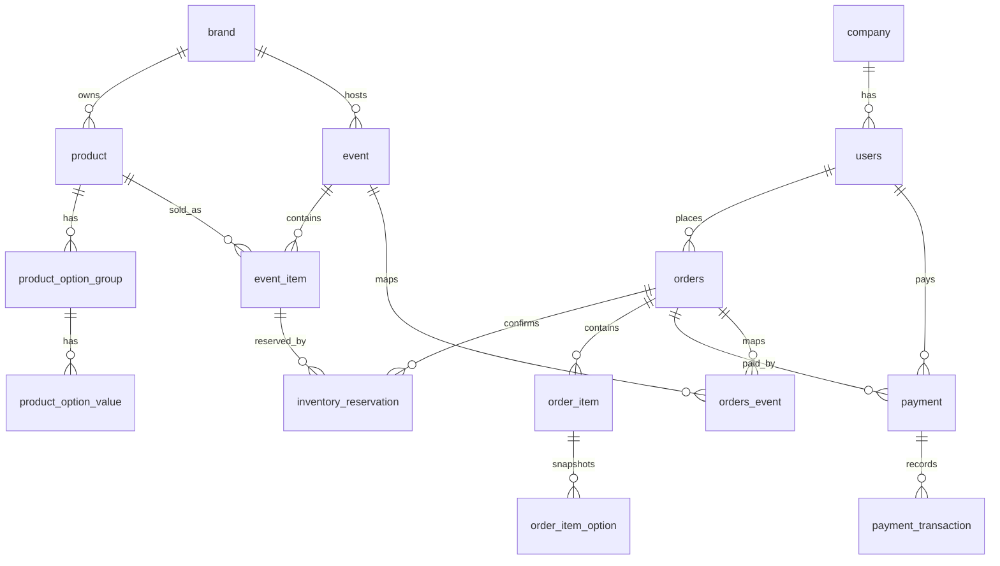

# ERD — Limited Drop Commerce

> 이 문서는 `limited-drop-commerce`의 데이터 모델 설명서다.

테이블 구조, 관계, 제약 조건, 인덱스 권장 사항을 정의한다.
도메인 흐름이나 API 세부 계약은 각각 `docs/use-cases.md`, `docs/api-contract.md`에서 관리한다.

---
## 1. ERD Overview

한정 판매 커머스의 데이터 모델은 다음 영역으로 나뉜다.

| 영역 | 주요 테이블 | 책임 |
|------|-------------|------|
| 회원/기업 | `users`, `company` | 일반 회원, 기업 회원, 기업 정보 관리 |
| 상품/브랜드 | `brand`, `product`, `product_option_group`, `product_option_value` | 브랜드, 상품, 상품 옵션 관리 |
| 드롭 이벤트 | `event`, `event_item` | 이벤트와 이벤트별 판매 상품/수량 관리 |
| 재고 선점 | `inventory_reservation` | 한정 수량 선점, 만료, 확정, 복구 상태 관리 |
| 주문 | `orders`, `order_item`, `order_item_option`, `orders_event` | 주문, 주문 상품, 주문 시점 옵션 스냅샷 관리 |
| 결제 | `payment`, `payment_transaction` | 결제 상태와 PG 트랜잭션 이력 관리 |

---

## 2. Logical Relationship Diagram



---

## 3. Table Details

### 3.1 `company`

기업 회원 정보를 저장한다.

| 컬럼 | 타입 | 설명 |
|------|------|------|
| `id` | `BIGINT` | 기업 PK |
| `company_name` | `VARCHAR(100)` | 회사명 |
| `business_number` | `VARCHAR(120)` | 사업자등록번호 |
| `ceo_name` | `VARCHAR(30)` | 대표자명 |
| `phone` | `VARCHAR(20)` | 대표 연락처 |
| `zip_code` | `VARCHAR(10)` | 우편번호 |
| `address1` | `VARCHAR(255)` | 기본 주소 |
| `address2` | `VARCHAR(255)` | 상세 주소 |
| `status` | `VARCHAR(20)` | 기업 상태 |
| `created_at` | `DATETIME` | 생성 일시 |
| `updated_at` | `DATETIME` | 수정 일시 |

상태값:

- `PENDING`
- `ACTIVE`
- `REJECTED`
- `SUSPENDED`

권장 제약:

- `business_number`는 unique로 관리한다.
- 기업 회원이 아닌 일반 회원은 `users.company_id`를 `NULL`로 둔다.

---

### 3.2 `users`

일반 회원과 기업 담당자 계정을 저장한다.

| 컬럼 | 타입             | 설명 |
|------|----------------|------|
| `id` | `BIGINT`       | 회원 PK |
| `company_id` | `BIGINT`       | 기업 ID. 기업 회원일 때 `company.id` 참조 |
| `user_type` | `VARCHAR(20)`  | 회원 유형 |
| `name` | `VARCHAR(20)`  | 회원 이름 |
| `password` | `VARCHAR(255)` | 비밀번호 해시 |
| `email` | `VARCHAR(200)` | 회원 이메일 |
| `phone` | `VARCHAR(15)`  | 회원 연락처 |
| `address` | `VARCHAR(255)` | 회원 주소 |
| `birth_date` | `VARCHAR(255)` | 생년월일 |
| `created_at` | `DATETIME`     | 생성 일시 |
| `updated_at` | `TIMESTAMP`    | 수정 일시 |

상태/유형값:

- `COMPANY`
- `USER`

권장 제약:

- `email`은 unique로 관리한다.
- `password`에는 평문이 아니라 단방향 해시를 저장한다.
- `birth_date`는 구현 시 `DATE` 타입을 우선 검토한다.

---

### 3.3 `brand`

상품과 이벤트를 소유하는 브랜드 정보를 저장한다.

| 컬럼 | 타입             | 설명 |
|------|----------------|------|
| `id` | `BIGINT`       | 브랜드 ID |
| `name` | `VARCHAR(100)` | 브랜드명 |
| `description` | `VARCHAR(255)` | 브랜드 설명 |
| `created_at` | `TIMESTAMP`    | 생성 일시 |
| `updated_at` | `TIMESTAMP`    | 수정 일시 |

관계:

- `brand` 1:N `product`
- `brand` 1:N `event`

---

### 3.4 `product`

판매 가능한 상품의 기준 정보를 저장한다.

| 컬럼 | 타입               | 설명 |
|------|------------------|------|
| `id` | `BIGINT`         | 상품 ID |
| `brand_id` | `BIGINT`         | 브랜드 ID |
| `name` | `VARCHAR(100)`   | 상품명 |
| `description` | `VARCHAR(255)`   | 상품 상세 설명 |
| `price` | `DECIMAL(15, 2)` | 상품 가격 |
| `status` | `VARCHAR(20)`     | 상품 상태 |
| `created_at` | `TIMESTAMP`      | 생성 일시 |
| `updated_at` | `TIMESTAMP`      | 수정 일시 |

상태값:

- `READY`
- `ON_SALE`
- `SOLD_OUT`
- `STOPPED`

관계:

- `product` N:1 `brand`
- `product` 1:N `product_option_group`
- `product` 1:N `event_item`

---

### 3.5 `product_option_group`

상품 옵션 그룹을 저장한다. 예: 색상, 사이즈.

| 컬럼 | 타입           | 설명 |
|------|--------------|------|
| `id` | `BIGINT`     | 상품 옵션 그룹 ID |
| `product_id` | `BIGINT`     | 상품 ID |
| `name` | `VARCHAR(50)` | 옵션 그룹명 |
| `display_order` | `INT`        | 노출 순서 |
| `required` | `TINYINT`    | 필수 여부 |
| `created_at` | `TIMESTAMP`  | 생성 일시 |
| `updated_at` | `TIMESTAMP`  | 수정 일시 |

관계:

- `product_option_group` N:1 `product`
- `product_option_group` 1:N `product_option_value`

---

### 3.6 `product_option_value`

상품 옵션 그룹에 속한 옵션값을 저장한다. 예: Black, 270.

| 컬럼 | 타입            | 설명 |
|------|---------------|------|
| `id` | `BIGINT`      | 상품 옵션값 ID |
| `option_group_id` | `BIGINT`      | 옵션 그룹 ID |
| `value` | `VARCHAR(20)` | 옵션값 |
| `status` | `VARCHAR(20)` | 옵션값 상태 |
| `created_at` | `TIMESTAMP`   | 생성 일시 |
| `updated_at` | `TIMESTAMP`   | 수정 일시 |

권장 제약:

- 같은 `option_group_id` 안에서 `value` 중복을 제한한다.

---

### 3.7 `event`

브랜드별 드롭 이벤트 정보를 저장한다.

| 컬럼           | 타입            | 설명        |
|--------------|---------------|-----------|
| `id`         | `BIGINT`      | 이벤트 ID    |
| `brand_id`   | `BIGINT`      | 브랜드 ID    |
| `title`      | `VARCHAR(200)` | 이벤트명      |
| `event_type` | `VARCHAR(20)` | 이벤트 타입    |
| `start_at`   | `DATETIME`    | 이벤트 시작 시간 |
| `end_at`     | `DATETIME`    | 이벤트 종료 시간 |
| `status`     | `VARCHAR(20)`  | 이벤트 상태    |
| `created_at` | `TIMESTAMP`   | 생성 일시     |
| `updated_at` | `TIMESTAMP`   | 수정 일시     |

상태값:

- `READY`
- `OPEN`
- `CLOSED`

관계:

- `event` N:1 `brand`
- `event` 1:N `event_item`

---

### 3.8 `event_item`

특정 이벤트에서 판매되는 상품과 이벤트 한정 재고를 저장한다.

| 컬럼 | 타입 | 설명 |
|------|------|------|
| `id` | `BIGINT` | 드롭 이벤트 상품 ID |
| `product_id` | `BIGINT` | 상품 ID |
| `event_id` | `BIGINT` | 드롭 이벤트 ID |
| `price` | `DECIMAL(15, 2)` | 이벤트 판매가 |
| `quantity` | `INT` | 이벤트 한정 재고 수 |
| `reserved_quantity` | `INT` | 임시 선점 재고 수 |
| `sold_quantity` | `INT` | 판매 완료 확정 수 |
| `created_at` | `TIMESTAMP` | 생성 일시 |
| `updated_at` | `TIMESTAMP` | 수정 일시 |

관계:

- `event_item` N:1 `event`
- `event_item` N:1 `product`
- `event_item` 1:N `inventory_reservation`

재고 계산:

```text
available_quantity = quantity - reserved_quantity - sold_quantity
```

동시성 처리 기준:

- Redis를 선착순 선점의 1차 기준으로 사용한다.
- DB의 `reserved_quantity`, `sold_quantity`는 확정 상태와 정합성 검증 기준으로 사용한다.

---

### 3.9 `inventory_reservation`

드롭 이벤트 상품의 재고 선점 이력을 저장한다.

| 컬럼 | 타입             | 설명 |
|------|----------------|------|
| `id` | `BIGINT`       | 재고 선점 ID |
| `reservation_no` | `VARCHAR(255)` | 재고 선점 번호 |
| `order_id` | `BIGINT`       | 주문 ID |
| `event_item_id` | `BIGINT`       | 드롭 이벤트 상품 ID |
| `reserved_quantity` | `INT`          | 선점 수량 |
| `status` | `VARCHAR(20)`   | 선점 상태 |
| `reserved_at` | `TIMESTAMP`    | 선점 시각 |
| `expires_at` | `TIMESTAMP`    | 결제 만료 시각 |
| `confirmed_at` | `TIMESTAMP`    | 결제 완료 또는 주문 확정 시각 |
| `released_at` | `TIMESTAMP`    | 재고 복구 시각 |
| `created_at` | `TIMESTAMP`    | 생성 일시 |
| `updated_at` | `TIMESTAMP`    | 수정 일시 |

상태값:

- `RESERVED`
- `CONFIRMED`
- `RELEASED`
- `EXPIRED`

상태 전이:

```text
RESERVED
  ├── CONFIRMED
  ├── RELEASED
  └── EXPIRED
```

관계:

- `inventory_reservation` N:1 `event_item`
- `inventory_reservation` N:1 `orders`

권장 제약:

- `reservation_no`는 unique로 관리한다.
- 결제 만료 복구는 멱등하게 처리한다.
- 같은 예약이 두 번 복구되어 `reserved_quantity`가 중복 차감/복구되지 않아야 한다.

---

### 3.10 `orders`

주문 기본 정보를 저장한다.

| 컬럼             | 타입               | 설명          |
|----------------|------------------|-------------|
| `id`           | `BIGINT`         | 주문 ID       |
| `order_no`     | `VARCHAR(255)`   | 주문 번호       |
| `user_id`      | `BIGINT`         | 회원 ID       |
| `status`       | `VARCHAR(20)`    | 주문 상태       |
| `total_amount` | `DECIMAL(15, 2)` | 총 결제 금액     |
| `expires_at`   | `TIMESTAMP`      | 결제 대기 만료 시간 |
| `ordered_at`   | `TIMESTAMP`      | 주문 생성 시각    |
| `canceled_at`  | `TIMESTAMP`      | 주문 취소 시각    |
| `expired_at`   | `TIMESTAMP`      | 주문 만료 시각    |
| `created_at`   | `TIMESTAMP`      | 생성 일시       |
| `updated_at`   | `TIMESTAMP`      | 수정 일시       |
| `delete_yn`    | `INT`            | 삭제 여부       |

상태값:

- `PENDING_PAYMENT`
- `PAID`
- `PAYMENT_FAILED`
- `EXPIRED`
- `CANCELED`

관계:

- `orders` N:1 `users`
- `orders` 1:N `order_item`
- `orders` 1:N `payment`
- `orders` 1:N `inventory_reservation`
- `orders` 1:N `orders_event`

정리 필요:

- 이미지에는 `created_at`이 주문 생성 시각과 생성 일시로 중복 표기된 것으로 보인다.
- 구현 시 `ordered_at`과 `created_at`을 분리할지, `created_at` 하나로 통일할지 결정해야 한다.
- `delete_yn`은 가능하면 `BOOLEAN` 또는 `TINYINT(1)`로 정의한다.

---

### 3.11 `order_item`

주문에 포함된 상품 라인을 저장한다.

| 컬럼 | 타입 | 설명 |
|------|------|------|
| `id` | `BIGINT` | 주문 상품 ID |
| `order_id` | `BIGINT` | 주문 ID |
| `product_id` | `BIGINT` | 상품 ID |
| `unit_price` | `DECIMAL(15, 2)` | 주문 상품 가격 |
| `quantity` | `INT` | 주문 수량 |
| `created_at` | `TIMESTAMP` | 생성 일시 |
| `updated_at` | `TIMESTAMP` | 수정 일시 |

관계:

- `order_item` N:1 `orders`
- `order_item` N:1 `product`
- `order_item` 1:N `order_item_option`

권장 사항:

- `unit_price`는 상품 가격 변경에 영향을 받지 않는 주문 시점 스냅샷이다.
- 금액 타입은 `orders.total_amount`, `product.price`, `event_item.price`, `payment.amount`와 동일하게 `DECIMAL(15, 2)`로 통일한다.

---

### 3.12 `order_item_option`

주문 시점의 옵션명과 옵션값을 스냅샷으로 저장한다.

| 컬럼 | 타입            | 설명 |
|------|---------------|------|
| `id` | `BIGINT`      | 주문 상품 옵션 ID |
| `order_item_id` | `BIGINT`      | 주문 상품 ID |
| `name` | `VARCHAR(50)` | 옵션명 |
| `value` | `VARCHAR(20)` | 옵션값 |
| `created_at` | `TIMESTAMP`   | 생성 일시 |
| `updated_at` | `TIMESTAMP`   | 수정 일시 |

옵션 스냅샷을 별도로 저장하는 이유:

- 주문 이후 상품 옵션명이 변경되어도 주문 이력은 변하지 않아야 한다.
- 삭제된 옵션도 기존 주문 상세에서는 조회 가능해야 한다.

---

### 3.13 `orders_event`

주문과 이벤트의 연결 정보를 저장한다.

| 컬럼 | 타입 | 설명 |
|------|------|------|
| `id` | `BIGINT` | 이벤트 연결 ID |
| `order_id` | `BIGINT` | 주문 ID |
| `event_id` | `BIGINT` | 이벤트 ID |

관계:

- `orders_event` N:1 `orders`
- `orders_event` N:1 `event`

권장 제약:

- 같은 주문과 이벤트 조합은 중복 저장되지 않도록 `unique(order_id, event_id)`를 둔다.

---

### 3.14 `payment`

주문 결제 정보를 저장한다.

| 컬럼 | 타입               | 설명 |
|------|------------------|------|
| `id` | `BIGINT`         | 결제 ID |
| `payment_no` | `VARCHAR(255)`   | 결제 번호 |
| `user_id` | `BIGINT`         | 사용자 ID |
| `order_id` | `BIGINT`         | 주문 ID |
| `status` | `VARCHAR(20)`     | 결제 상태 |
| `amount` | `DECIMAL(15, 2)` | 결제 금액 |
| `requested_at` | `TIMESTAMP`      | 결제 요청 시각 |
| `approved_at` | `TIMESTAMP`      | 결제 승인 시각 |
| `failed_at` | `TIMESTAMP`      | 결제 실패 시각 |
| `canceled_at` | `TIMESTAMP`      | 결제 취소 시각 |
| `idempotency_key` | `VARCHAR(255)`   | 멱등성 키 |
| `created_at` | `TIMESTAMP`      | 생성 일시 |
| `updated_at` | `TIMESTAMP`      | 수정 일시 |

상태값:

- `REQUESTED`
- `APPROVED`
- `FAILED`
- `CANCELED`

관계:

- `payment` N:1 `users`
- `payment` N:1 `orders`
- `payment` 1:N `payment_transaction`

권장 제약:

- `payment_no`는 unique로 관리한다.
- `idempotency_key`는 PG 승인 재시도 중복 처리를 위해 unique 또는 조건부 unique를 검토한다.

---

### 3.15 `payment_transaction`

PG 요청/응답 트랜잭션 이력을 저장한다.

| 컬럼 | 타입             | 설명 |
|------|----------------|------|
| `id` | `BIGINT`       | 결제 트랜잭션 ID |
| `payment_id` | `BIGINT`       | 결제 ID |
| `transaction_type` | `VARCHAR(20)`  | 트랜잭션 유형 |
| `external_transaction_id` | `VARCHAR(255)` | PG 거래 ID |
| `request_payload` | `TEXT`         | PG 요청 전문 |
| `response_payload` | `TEXT`         | PG 응답 전문 |
| `transaction_status` | `VARCHAR(20)`  | 트랜잭션 처리 상태 |
| `created_at` | `TIMESTAMP`    | 발생 일시 |
| `updated_at` | `TIMESTAMP`    | 수정 일시 |

트랜잭션 유형:

- `REQUEST`
- `APPROVE`
- `FAIL`
- `CANCEL`

처리 상태:

- `SUCCESS`
- `FAIL`
- `TIMEOUT`
- `ERROR`

권장 사항:

- 원문 payload에는 카드번호, 인증 토큰, 개인정보 등 민감 정보를 저장하지 않는다.
- PG 거래 ID가 있는 경우 `external_transaction_id` 조회 인덱스를 둔다.

---

## 4. Relationship Summary

| 관계 | 카디널리티 | 설명 |
|------|------------|------|
| `company` → `users` | 1:N | 하나의 기업에 여러 담당자 계정이 속할 수 있다. |
| `users` → `orders` | 1:N | 한 회원은 여러 주문을 생성할 수 있다. |
| `users` → `payment` | 1:N | 한 회원은 여러 결제 요청을 만들 수 있다. |
| `brand` → `product` | 1:N | 하나의 브랜드는 여러 상품을 가진다. |
| `brand` → `event` | 1:N | 하나의 브랜드는 여러 드롭 이벤트를 운영할 수 있다. |
| `product` → `product_option_group` | 1:N | 상품은 여러 옵션 그룹을 가진다. |
| `product_option_group` → `product_option_value` | 1:N | 옵션 그룹은 여러 옵션값을 가진다. |
| `event` → `event_item` | 1:N | 이벤트는 여러 판매 상품을 포함한다. |
| `product` → `event_item` | 1:N | 한 상품은 여러 이벤트에서 판매될 수 있다. |
| `event_item` → `inventory_reservation` | 1:N | 이벤트 상품은 여러 선점 이력을 가진다. |
| `orders` → `inventory_reservation` | 1:N | 주문은 하나 이상의 선점 이력과 연결될 수 있다. |
| `orders` → `order_item` | 1:N | 주문은 여러 주문 상품을 가진다. |
| `order_item` → `order_item_option` | 1:N | 주문 상품은 여러 옵션 스냅샷을 가진다. |
| `orders` → `payment` | 1:N | 주문은 결제 재시도 또는 취소 이력 때문에 여러 결제 레코드를 가질 수 있다. |
| `payment` → `payment_transaction` | 1:N | 결제는 여러 PG 트랜잭션 이력을 가진다. |
| `orders` ↔ `event` | N:M | `orders_event`로 주문과 이벤트를 연결한다. |

---

## 5. Index and Constraint Recommendations

### 5.1 Unique Constraints

| 테이블 | 컬럼 |
|--------|------|
| `company` | `business_number` |
| `users` | `email` |
| `orders` | `order_no` |
| `inventory_reservation` | `reservation_no` |
| `payment` | `payment_no` |
| `orders_event` | `order_id`, `event_id` |

### 5.2 Lookup Indexes

| 테이블 | 인덱스 후보 |
|--------|-------------|
| `users` | `company_id`, `email` |
| `product` | `brand_id`, `status` |
| `event` | `brand_id`, `status`, `start_at`, `end_at` |
| `event_item` | `event_id`, `product_id` |
| `inventory_reservation` | `event_item_id`, `order_id`, `status`, `expires_at` |
| `orders` | `user_id`, `status`, `expires_at`, `created_at` |
| `order_item` | `order_id`, `product_id` |
| `payment` | `order_id`, `user_id`, `status`, `idempotency_key` |
| `payment_transaction` | `payment_id`, `external_transaction_id`, `transaction_type` |

---
